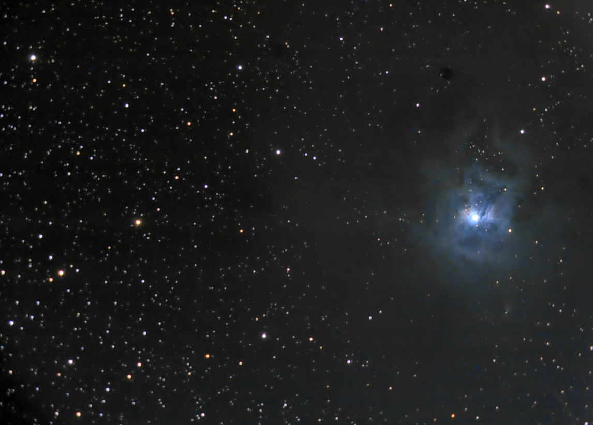

# NGC7023 - Iris Nebula

Feel free to use or publish this material, modified or not.
The only condition is that the credit line include the phrase
"Image Acquisition by Guillaume Gimenez" with a link to this
repository.

# Processed with [DarkFlow](http://www.darkflow.org/).

Image processing is simpler with good quality source photographs.

Here, the quality of the raw photos is poor, hence the processing
is a bit complicated with a resulting picture a bit dull with not
a lot of details in the dark parts of the nebula.

# Contribute
You can contribute to this repository, fork it, try
[DarkFlow](http://www.darkflow.org/) and make a pool request.
Your processing will be added in its dedicated branch. And the
best looking picture will be made the default branch.
